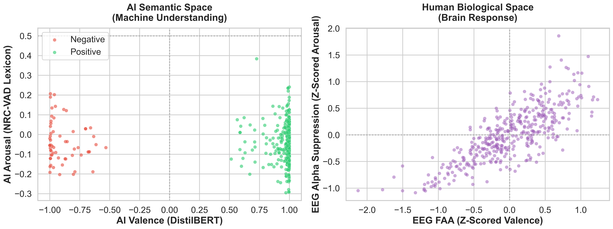
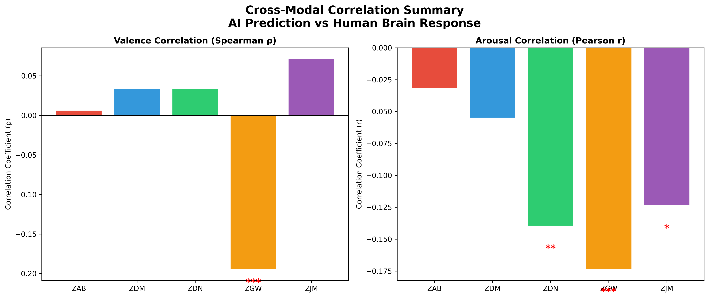
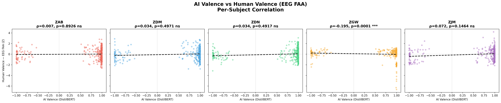
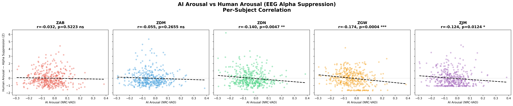

<p align="center">
  <h1 align="center">🧠 Neuro-Linguistic Alignment</h1>
  <p align="center"><strong>Where NLP Meets EEG — Exposing What AI Gets Wrong About Human Emotion</strong></p>
  <p align="center">
    
    
    
    
  </p>
</p>

---

This project cross-validates AI sentiment predictions against **real human brain responses** recorded via 128-channel EEG while subjects read movie review sentences. By placing AI and human cognition in the same Valence–Arousal space, we expose where modern NLP models fundamentally fail to capture how humans actually process language.

<p align="center">
  
  <br>
  <em>Left: AI separates text into clean positive/negative clusters. Right: The human brain tells a far messier, more nuanced story.</em>
</p>

---

## 🔍 Interesting Findings

### 1. Irony & Humor — Lost in Translation

AI misses cultural references and pragmatic meaning. When Homer Simpson is described as slacking off at the nuclear power plant, the model reads it at face value. Humans show amusement (high arousal, positive engagement) — the AI sees an employee displaying bad behavior.

### 2. Scandal "Juiciness" — Curiosity ≠ Negativity

For scandal-related text, **humans show high engagement and curiosity** (elevated alpha suppression), while the AI only reads surface-level negativity. The brain is *interested*, not *upset* — a distinction current sentiment models can't make.

### 3. Award-Heavy Sentences — Cognitive Overload

Long enumerations of awards and honors get confidently tagged as **positive** by the AI regardless of context. For example human EEG shows **negative FAA** at sentences with many awards for war heroes.

---

## 📊 Per-Subject Correlation Results

<p align="center">
  
</p>

| Subject | Valence ρ | Valence p | Arousal r | Arousal p | Significant? |
|---------|-----------|-----------|-----------|-----------|:------------:|
| ZAB     | 0.007     | 0.893     | −0.032    | 0.522     | — |
| ZDM     | 0.034     | 0.497     | −0.055    | 0.266     | — |
| ZDN     | 0.034     | 0.492     | −0.140    | 0.005     | ✦✦ Arousal |
| **ZGW** | **−0.195**| **<0.001**| **−0.174**| **<0.001**| **✦✦✦ Both** |
| ZJM     | 0.072     | 0.146     | −0.124    | 0.012     | ✦ Arousal |

> Subject **ZGW** shows significant alignment on *both* dimensions — the only subject where the AI's predictions meaningfully track neural responses. Most subjects show weak or no correlation, underscoring the gap between machine and human cognition.

<details>
<summary><strong>Per-Subject Scatter Plots</strong> (click to expand)</summary>
<br>
<p align="center">
  
  <br><em>AI Valence (DistilBERT) vs Human Valence (EEG Frontal Alpha Asymmetry), per subject</em>
</p>
<p align="center">
  
  <br><em>AI Arousal (NRC-VAD Lexicon) vs Human Arousal (EEG Alpha Suppression), per subject</em>
</p>
</details>

---

## ⚙️ System Architecture

```
┌─────────────────────────────────────────────────────────────────────┐
│                         INPUT: SST Sentences                        │
│                    (407 sentences × 12 subjects)                    │
└──────────────────────────┬──────────────────────────────────────────┘
                           │
              ┌────────────┴────────────┐
              ▼                         ▼
   ┌─────────────────────┐   ┌─────────────────────────┐
   │     NLP ENGINE       │   │      DSP ENGINE          │
   │                     │   │                           │
   │  Preprocessing:     │   │  128-ch EEG (500 Hz)     │
   │  • Tokenization     │   │  • 4-40 Hz Bandpass      │
   │  • Stop Word Removal│   │  • 50 Hz Notch Filter    │
   │  • Lemmatization    │   │  • ICA Artifact Rejection│
   │                     │   │  • Welch PSD Estimation  │
   │  Valence:           │   │                           │
   │  • DistilBERT       │   │  Features:               │
   │  • 91% F1 on SST-2  │   │  • FAA (Frontal Alpha    │
   │                     │   │    Asymmetry) → Valence   │
   │  Arousal:           │   │  • Alpha Suppression      │
   │  • NRC-VAD Lexicon  │   │    → Arousal              │
   └────────┬────────────┘   └────────────┬──────────────┘
            │                              │
            ▼                              ▼
   ┌─────────────────┐          ┌─────────────────────┐
   │ Machine Sentiment│          │  Human Sentiment     │
   │ (Valence,Arousal)│          │  (FAA, α-Suppress.)  │
   └────────┬─────────┘          └──────────┬──────────┘
            │                               │
            └───────────┬───────────────────┘
                        ▼
            ┌───────────────────────┐
            │  STATISTICAL ANALYSIS  │
            │  • Z-scoring (per subj)│
            │  • Spearman ρ (Valence)│
            │  • Pearson r (Arousal) │
            │  • Alignment Scoring   │
            └───────────────────────┘
```

---

## 🧪 Technical Details

### NLP Pipeline (Dual-Stream)

| Component | Method | Details |
|-----------|--------|---------|
| **Preprocessing** | Classical NLP | Regex cleaning → NLTK tokenization → Stop word removal → WordNet lemmatization |
| **Valence** | DistilBERT | `distilbert-base-uncased-finetuned-sst-2-english` · 91% weighted F1 on SST-2 validation |
| **Arousal** | NRC-VAD Lexicon v2.1 | 20,000+ words with Valence-Arousal-Dominance ratings · Mean arousal of matched tokens |

### EEG Pipeline (MNE-Python)

| Stage | Method | Parameters |
|-------|--------|------------|
| **Filtering** | FIR Bandpass + Notch | 4–40 Hz passband, 50 Hz notch (line noise) |
| **Artifact Rejection** | ICA | 5 components, component 0 excluded (eye blinks) |
| **Spectral Analysis** | Welch PSD | Alpha band (8–13 Hz), n_fft up to 256 |
| **Valence Proxy** | Frontal Alpha Asymmetry (FAA) | `ln(α_right) − ln(α_left)` using channels E24/E124 (EGI 128) |
| **Arousal Proxy** | Global Alpha Suppression | `1 / mean(α_frontal)` across channels E11, E23, E24, E105 |

### Statistical Framework

- **Subject-level Z-scoring** normalizes biological variance across individuals
- **Spearman ρ** for valence correlation (handles DistilBERT's bimodal distribution)
- **Pearson r** for arousal correlation (continuous NRC-VAD scores)
- **Alignment Score** = `AI_Valence(Z) × EEG_FAA(Z)` — positive = agreement, negative = misalignment

---

## 🗂️ Repository Structure

```
NLP-EEG/
├── main.py                    # Full pipeline: data loading → NLP → EEG → correlation
├── phase1_sentiment.py        # Standalone NLP sentiment validation (Phase 1)
├── requirements.txt           # Python dependencies
├── LICENSE                    # MIT License
├── Neuro_Linguistic_Alignment_Presentation.pptx
│
└── results/
    ├── dual_cognitive_map.png       # AI vs Human valence-arousal space
    ├── correlation_summary.png      # Per-subject correlation bar chart
    ├── valence_per_subject.png      # Valence scatter plots (5 subjects)
    ├── arousal_per_subject.png      # Arousal scatter plots (5 subjects)
    ├── aligned_features.csv         # Full feature matrix (2035 rows)
    ├── sentence_alignment.csv       # Sentence-level alignment scores
    └── subject_correlations.csv     # Per-subject correlation statistics
```

---

## 🚀 Getting Started

### Prerequisites

- Python 3.8+
- ~2GB disk space for DistilBERT model download (automatic on first run)

### Installation

```bash
git clone https://github.com/omar4a/NLP-EEG.git
cd NLP-EEG
pip install -r requirements.txt
```

### Data Setup

This project uses the [ZuCo dataset](https://osf.io/q3zws/) (Zurich Cognitive Language Processing Corpus). Due to size, the raw EEG data is not included in this repository.

1. Download the ZuCo Task 3 (Sentiment Reading) data from [OSF](https://osf.io/q3zws/)
2. Place the preprocessed files in a `Preprocessed/` directory **one level above** the project root:

```
Parent Directory/
├── Preprocessed/
│   ├── sentencesTSR.mat          # 407 sentence stimuli
│   ├── relations_task_specific.csv
│   ├── ZAB/                      # Per-subject EEG recordings
│   │   ├── gip_ZAB_TSR1_EEG.mat
│   │   ├── ...
│   ├── ZDM/
│   ├── ZDN/
│   ├── ...  (12 subjects total)
│
└── Project/  ← this repository
    ├── main.py
    ├── ...
```

3. Download the [NRC-VAD Lexicon v2.1](https://saifmohammad.com/WebPages/nrc-vad.html) and place it in:
   ```
   NRC-VAD-Lexicon-v2.1/NRC-VAD-Lexicon-v2.1/NRC-VAD-Lexicon-v2.1.txt
   ```

### Running

```bash
python main.py
```

The pipeline will:
1. Validate DistilBERT on SST-2 (reports F1 score)
2. Load ZuCo EEG data for 5 subjects (ZAB, ZDM, ZDN, ZGW, ZJM)
3. Extract NLP features (valence + arousal) for all 407 sentences
4. Process EEG epochs (filter → ICA → PSD → FAA/suppression)
5. Compute per-subject correlations and generate all visualizations in `results/`

---

## 📝 Key Takeaways

> **AI achieves 91% accuracy on literal text — but struggles with context, irony, and pragmatics.**

The cross-modal analysis reveals cognitive dimensions *invisible* to NLP models: curiosity toward scandal, cognitive overload from dense text, humor from cultural references. These findings suggest that **EEG-derived features could serve as training signals** to build sentiment models that understand language more like humans do.

---

<p align="center"><em>Built as part of CSE 389: Natural Language Processing — Spring 2026</em></p>
